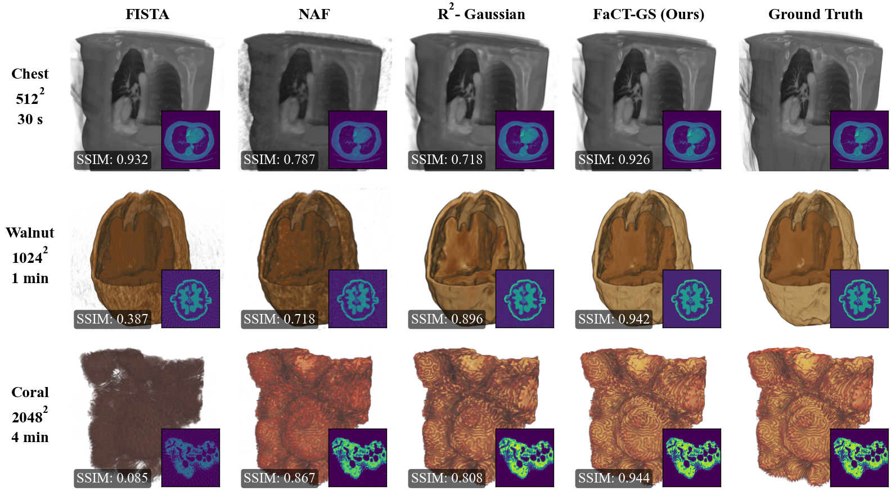

# FaCT-GS: Fast and Scalable CT Reconstruction with Gaussian Splatting

<div align="center">



###  [Paper](TBA) | [Project Page](https://papieta.github.io/fact-gs/)

</div>

## Introduction

Official repository for our paper titled FaCT-GS: Fast and Scalable CT Reconstruction with Gaussian Splatting. 

#### Related repositories (included in the installation):

[Fast Gaussian Splatting CT Rasterizer](https://github.com/PaPieta/gs-ct-rasterizer) | [Fast Gaussian Splatting Voxelizer](https://github.com/PaPieta/gs-voxelizer) | [Fused SSIM](https://github.com/rahul-goel/fused-ssim) (2D and 3D) | [Fused 3D TV](https://github.com/PaPieta/fused-3D-tv)

## Installation

You need to have an NVIDIA GPU with CUDA installed (tested with CUDA 12.1). 

Create a dedicated Python environment and install the dependencies:

```sh
git clone --recurse-submodules https://github.com/PaPieta/fact-gs.git 
cd fact-gs
conda env create -f environment.yml
conda activate fact-gs
export GLM_HOME="$(pwd)/fact_gs/submodules/glm"
pip install --no-build-isolation -r submodules.txt
```

The GLM_HOME variable is necessary to automatically link it to the voxelizer and rasterizer submodules.

:exclamation: Consider [using mamba instad of conda](https://iamdamilare13.medium.com/mamba-vs-conda-know-the-differences-and-similarities-be3ae94d2542) for much faster installation. When available, it should be enough to replace the env creation call with `mamba env create -f environment.yml`

## Data

>This section is a skeleton, will be expanded soon.

The main dataset is sourced from the [r2_gaussian](https://github.com/Ruyi-Zha/r2_gaussian/tree/main/r2_gaussian/) project. Check download instructions [here](https://github.com/Ruyi-Zha/r2_gaussian/tree/main?tab=readme-ov-file#2-dataset).

The remaining data can be downloaded from: TBA

## Running the code

All scripts are parametrized with a [Hydra](https://hydra.cc/) config, located at the ```config``` folder. It can be modified directly, or when invoking the script. 

Both reconstruction and volume fitting expect the r2_gaussian data layout (```meta_data.json```)

<details>
<summary><span style="font-weight: bold;">Parameters shared by all scripts</span></summary>

(overwrite with *category.parameter=new_value*)

**Model:**
* **num_gaussians** - Number of Gaussians the optimization is initialized with
* **data_source_path** - Path to the source data folder used during optimization
* **model_path** - Directory where checkpoints, evaluation dumps and exported point clouds are saved
* **init_mode** - How Gaussians are initialized:
    * ```gradient``` - gaussian locations sampled based on a probability distribution from a gradient of an FDK-reconstructed volume
    * ```intensity``` - above, but using intensities directly and not their gradients
    * ```precomputed/prior``` - only applicable for reconstruction (see below)
* *density_thresh* - Minimum voxel density used to discard background voxels during initialization
* *density_rescale* - Empirical scaling applied to the sampled densities to compensate for multi-Gaussian occlusion
* *scale_min* / *scale_max* - Lower and upper scale bounds expressed as a fraction of the target volume, converted to world units at runtime
* *eval* - When False only the training cameras are loaded from ```meta_data.json```

**Optimization:**
* **steps** - Number of optimization steps to run. One step equals one rasterization/voxelization pass with backward propagation. In CT recon, an ```iteration``` consists of processing all available projections. For volume fitting, since there is only one volume used, ```step==iteration```
* *position_lr_init/final/max_steps* - Learning rate schedule for Gaussian centers; ```*_max_steps``` is expressed as a fraction of ```steps```
* *density_lr_init/final/max_steps* - Learning rate schedule for Gaussian densities/opacity
* *scaling_lr_init/final/max_steps* - Learning rate schedule for per-axis scales
* *rotation_lr_init/final/max_steps* - Learning rate schedule for spherical harmonics rotations
* *lambda_dssim* - Weight of the DSSIM loss component (set to 0 to disable)
* *lambda_tv* - Weight of the 3D total-variation regularizer
* **densify_gaussians** - Enables/disables periodic Gaussian densification and pruning
* *density_min_threshold* - Minimum density allowed during pruning; Gaussians below the threshold get removed
* *densification_interval/densify_from_step/densify_until_step_percent* - Controls when densification starts, how often it is triggered, and up to what portion of training it remains active
* *densify_grad_threshold* - Gradient magnitude threshold a Gaussian must exceed to be duplicated during densification
* *densify_scale_threshold* - Largest acceptable Gaussian scale (in % of the volume size) before it gets split during densification
* *max_screen_size* / *max_scale* / *max_num_gaussians* - Optional guards that clamp 2D footprint, 3D scale, or total Gaussian count; `max_num_gaussians` is a multiplier of the initial `num_gaussians` (default `1.1` = 110%)

**Evaluation:**
* *eval_in_training* - Run quantitative evaluation in the middle of training
* *every_n_steps* - Evaluation frequency measured in optimization steps (ignored when ```eval_in_training=False```)
* *eval_start* - If True, evaluate the initialization before any optimization step
* *eval_end* - If True, evaluate after the final step (used for leaderboard metrics)
* *visualize_at_eval* - When enabled, dumps reconstructed volumes (tiff + preview) at evaluation checkpoints
* *visualize_gaussians* - Exports Gaussian position/footprint visualizations and error maps for debugging

**Profiling:**
* *profile* - Turns PyTorch's profiler on/off
* *profile_wait* - How many steps to wait before collecting a trace
* *profile_active* - Number of active steps that are recorded in the trace

</details>

<details>
<summary><span style="font-weight: bold;">Some more details on using Hydra</span></summary>

Parameters can either be changed directly in the ```config``` folders,  or when invoking the script.

To change a specific parameter, use:

```python script.py category.parameter=new_parameter_val```

e.g: ```python train_recon.py optim.steps=10000```

To change a whole config preset, use: 

```python script.py category=new_category_preset```

e.g: ```python train_recon.py eval=eval_silent```

For major adjustments, it is recommended to create your own config presets. 

</details>

### CT Reconstruction

The most default reconstruction can be ran with:

```sh
python train_recon \
    model.data_source_path=your/path/to/scan/data \
    model.model_path=path/where/trained/model/should/be/saved 
```

<details>
<summary><span style="font-weight: bold;">Parameters unique to reconstruction</span></summary>

**Model:**
* **init_mode**:
    * ```prior``` - - Warm-start the optimization from a volume prior fitted with ```train_volume```. Requires setting **prior_path** to a valid model (see below)
    * ```precomputed``` - Load initialized gaussians from a precomputed point cloud. Legacy from r2-gaussian separate init procedure (expects an ```init_[data_name].npy``` file in the data folder ).
* **prior_path** - Absolute path to the ```point_cloud.pickle``` model file that should be loaded when ```init_mode=prior```


**Optimization:**
* *tv_vol_size* - Side length (in voxels) of the cube that is randomly sampled for the 3D TV loss during reconstruction

</details>

### Volume fitting

Volume fitting can be split into to categeories:

1. Fitting for the purpose of CT reconstruction volumetric prior warm-start. Target volume is assumed to be named ```vol_prior.[npy/tiff]``` (controlled with ```model.vol_name```):

    ```sh
    python train_volume \
        model.data_source_path=your/path/to/volume/data \
        model.model_path=path/where/trained/model/should/be/saved 
    ```

2. Fitting for volume compression, or simply for creating a gaussian-based representation. Target volume is assumed to be named ```vol_gt.[npy/tiff]```. Here we train for longer to get a closer match:
    ```sh
    python train_volume \
        --config-name compress_volume \
        model.data_source_path=your/path/to/volume/data \
        model.model_path=path/where/trained/model/should/be/saved 
    ```

<details>
<summary><span style="font-weight: bold;">Parameters unique to volume fitting</span></summary>

**Model:**
* **vol_name** - Name (without extension) of the ground-truth volume inside the dataset directory that should be fitted, e.g., ```vol_prior``` or ```vol_gt```

**Optimization:**
* *quantize* - Enables straight-through-estimator quantization of Gaussian positions/scales/rotations/densities during training for model-size control. Useful for GS-based compression
* *pos_bits* / *scale_bits* / *rot_bits* / *feat_bits* - Bit precision allocated to xyz, scale, rotation and density/features when ```quantize=True``` (also used by the model size reporter)

</details>
    
### CT reconstruction from a volumetric prior

First fit the Gaussian representation to a volume (see above). Find path to the trained point cloud (ends with ```point_cloud.pickle```). Then call:
```
python train_recon \
    --config-name fromPrior_recon \
    model.data_source_path=your/path/to/scan/data \
    model.model_path=path/where/trained/model/should/be/saved \
    model.prior_path=path/to/trained/point_cloud.pickle \
```

## Prepare your own data

>Data preparation/generation is largely copied from [r2_gaussian](https://github.com/Ruyi-Zha/r2_gaussian/tree/main/r2_gaussian/).

Our code supports both cone beam and parallel beam configurations.

If you have ground truth volumes but do not have X-ray projections, follow [this instruction](fact_gs/r2_gaussian/data_generator/synthetic_dataset/README.md) to generate your own dataset.

If you have (more than 100) X-ray projections but do not have ground volumes, follow  [this instruction](fact_gs/r2_gaussian/data_generator/real_dataset/README.md).

If you want to test your own data, please first convert it to the r2_gaussian format (```meta_data.json```).

:exclamation: Gaussian initialization is integrated into the reconstruction step for smoother experience. The separate init capability from r2_gaussian is still retained, but not recommended.

## Running experiments from the paper

> The experiment list below is not complete, will be finalized soon.

The `experiments/` folder contains ready-made shells for each study discussed in the paper:

- `main_experiment.sh` – Reconstructions for all scans in the r2_gaussian dataset (Tab. 1).
- `init_comparison_experiment.sh` – Comparing the impact of various initialization strategies (Fig. 5)
- `compression_experiment.sh` – Quality of volume fitting and compression (Fig. 6, Tab. 2)
- `warm_start_experiment.sh` – Impact of warm-start on reconstruction speed and quality (Supplementary material, Tab. 3)
- `gaussian_study_r2data_experiment.sh` and `gaussian_study_coraldata_experiment.sh` - Ablation study on the impact of initial number of gaussians on reconstruction quality (Supplementary material, Fig. 8). :exclamation: Warning - slow.

All scripts default to `$(pwd)` as the root for data and model outputs. To run them on a different storage location, export `MAIN_ROOT=/path/to/root` before launching, e.g.

```bash
export MAIN_ROOT=/my/data/and/models/path
source experiments/main_experiment.sh
```

Each shell wraps the corresponding helper in `experiments/helpers/` to collect metrics into CSV files right after the training finishes.

## Citation

If this repository helped in your research, please consider citing our work:
```
TBA
```

## Acknowledgements

Based on [r2_gaussian](https://github.com/Ruyi-Zha/r2_gaussian/tree/main/r2_gaussian/submodules/xray-gaussian-rasterization-voxelization). Inspired by [image-gs](https://github.com/NYU-ICL/image-gs), [taming-3dgs](https://github.com/humansensinglab/taming-3dgs), [StopThePop](https://github.com/r4dl/StopThePop).

## License

MIT License, excluding the contents of folders ```fact_gs/r2_gaussian``` and ```fact_gs/submodules```. See LICENSE file for details.
